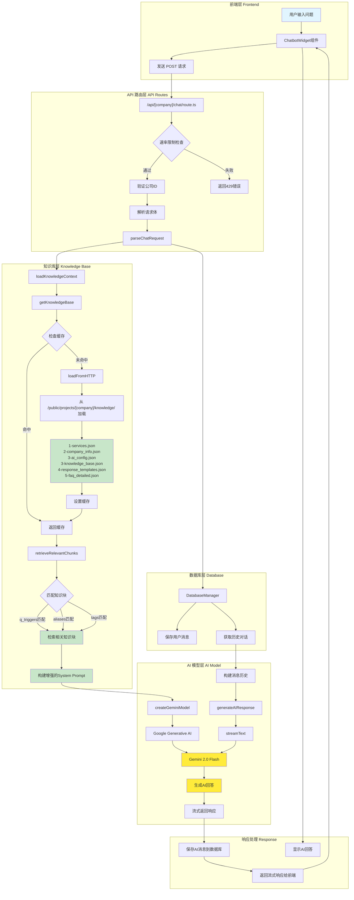
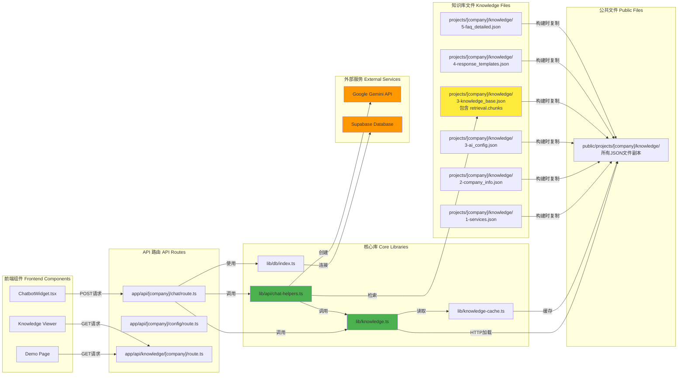
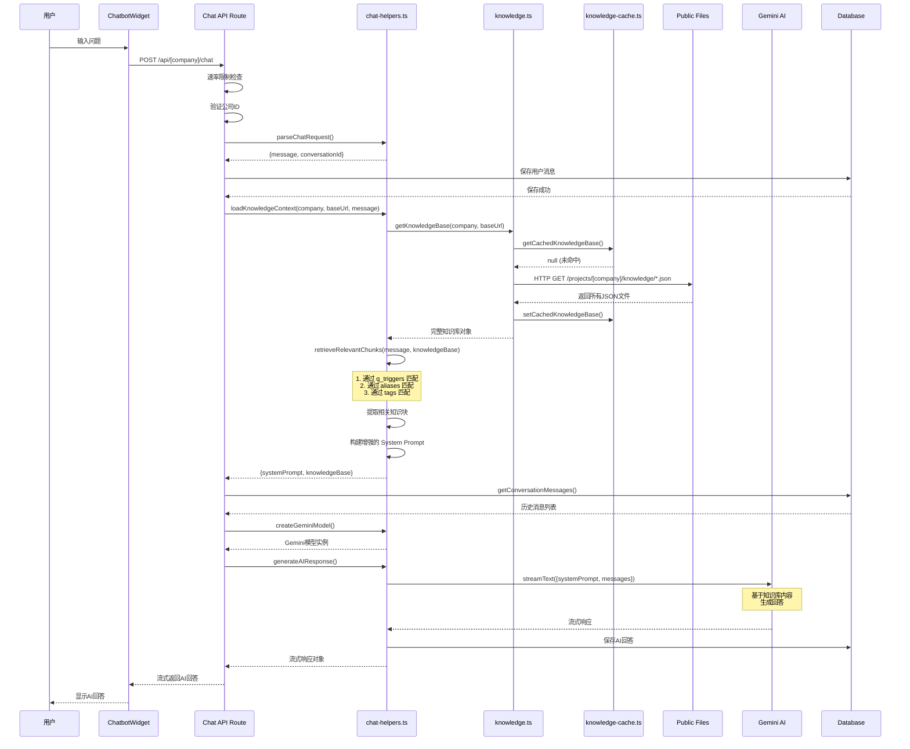
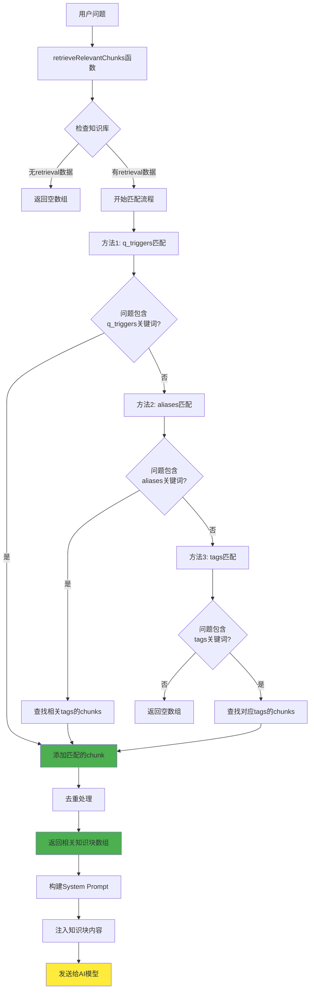
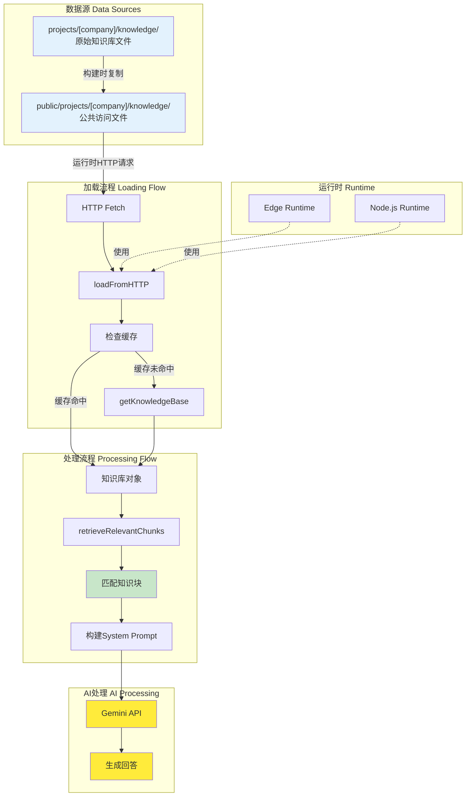

# 系统架构流程图

## 完整系统流程图

## 文件关系图

## 检索机制详细流程

## 知识库检索机制

## 数据流向图

## 关键文件说明

### 核心文件
- **`app/api/[company]/chat/route.ts`**: 聊天API入口，处理HTTP请求
- **`lib/api/chat-helpers.ts`**: 聊天辅助函数，包含检索机制和AI调用
- **`lib/knowledge.ts`**: 知识库加载和管理
- **`lib/knowledge-cache.ts`**: 知识库缓存机制

### 知识库文件
- **`3-knowledge_base.json`**: 包含 `retrieval.chunks` 的核心知识库文件
- **`2-ai_config.json`**: AI配置，包含意图识别和实体提取
- **其他JSON文件**: 服务信息、公司信息、FAQ等

### 数据流
1. **构建时**: `projects/` → `public/projects/` (通过 copy-knowledge.sh)
2. **运行时**: HTTP请求 → 缓存检查 → 加载知识库 → 检索匹配 → AI生成

